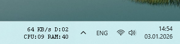

# TaskbarWidgetPDH

Легковесный виджет для панели задач Windows, отображающий метрики производительности системы: загрузку ЦП, использование ОЗУ, активность диска и скорость сети.



## Возможности

- Отображение загрузки CPU, RAM, диска и сети прямо на панели задач.
- Низкое потребление системных ресурсов.
- Двойной клик для открытия Диспетчера задач.
- Клик правой кнопкой мыши для закрытия виджета.

## Требования

- Windows 10 или новее.
- Компилятор C++, например, входящий в состав Visual Studio.

## Сборка

Проект можно собрать, запустив скрипт `build.bat`. Он скомпилирует приложение и создаст `TaskbarWidgetPDH.exe` в каталоге проекта.

```bash
build.bat
```

## Использование

Просто запустите скомпилированный `TaskbarWidgetPDH.exe`. Виджет автоматически разместится на панели задач.

## Лицензия

Этот проект лицензирован под лицензией MIT. Подробности см. в файле [LICENSE](LICENSE).