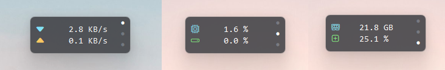

# TaskbarWidgetPDH

Легковесный виджет для панели задач Windows, отображающий метрики производительности системы на основе Performance Data Helper (PDH).



## Возможности

- 📶 **Три режима отображения**, переключаемые кликом по иконкам справа:
  - **Сеть** — скорость приёма/передачи (▼/▲)
  - **CPU + Диск** — загрузка процессора и диска
  - **Память** — доступная ОЗУ (ГБ) и процент занятой памяти
- 📊 Мониторинг: загрузка CPU, активность диска, использование ОЗУ, скорость сети
- 🖱️ Перетаскивание мышью по панели задач
- 🪟 Двойной клик — открытие Диспетчера задач
- 🎨 Полупрозрачное окно с закруглёнными углами (Windows 11+)
- 💾 Сохранение позиции окна в реестре
- ⚡ Низкое потребление системных ресурсов

## Требования

- Windows 10 или новее.
- Компилятор C++, например, входящий в состав Visual Studio.

## Сборка

Проект можно собрать, запустив скрипт `build.bat`. Он скомпилирует приложение и создаст `TaskbarWidgetPDH.exe` в каталоге проекта.

```bash
build.bat
```

## Использование

Просто запустите скомпилированный `TaskbarWidgetPDH.exe`. Виджет автоматически появится на панели задач.

- **Клик по квадратным иконкам справа** — переключение режимов (Сеть / CPU+Диск / Память)
- **Перетаскивание мышью** — перемещение виджета
- **Двойной клик** — открытие Диспетчера задач Windows
- **Правый клик** — контекстное меню (закрытие виджета)

### Примечание

Если виджет не запускается с ошибкой `0x800007D0`, попробуйте восстановить счётчики производительности:

```bash
lodctr /R
```

Затем перезагрузите компьютер.

## Лицензия

Этот проект лицензирован под лицензией MIT. Подробности см. в файле [LICENSE](LICENSE).
